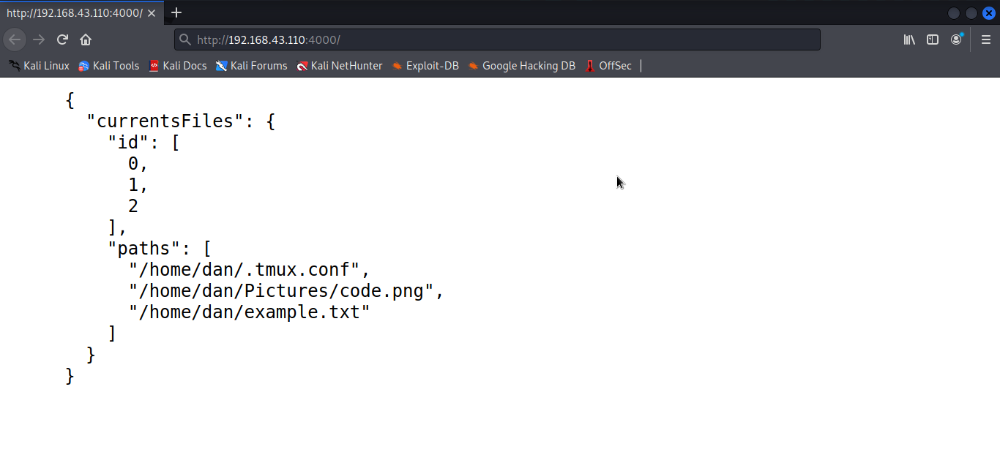
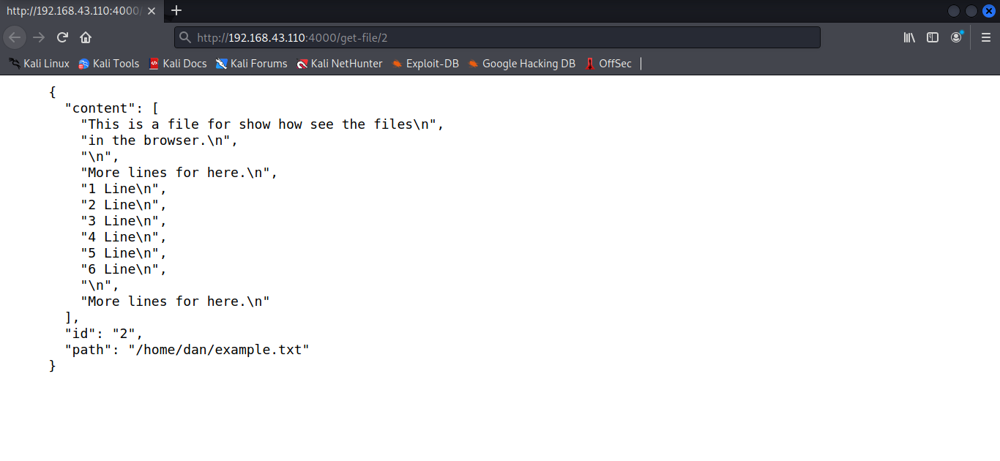

# Python Server Files.

__This is a small server maked with python3 and flask, you can use this server for send files, images png or jpg. Or whatever other format,  etc.__

__The server have 5 routes for use:__
* __/ or /home__   (This route have the method GET)
* __/get-file__    (This route have the method GET)
* __/add-path__    (This route have the method POST)
* __/update-path__  (This route have the method PUT)
* __/delete-path__   (This route have the method DELETE)


## Dependecies.
__You can install the dependencies with the requirements file, in this proyect. But this proyect only depend of flask module. Executing:__

```bash
$ pip3 install -r requirements.txt
```

## Run and Use.
__For run the server, we must pass diferent options. The server have the host 0.0.0.0 (We can have access him from whatever device in our local network). Example:__

In this case we are running our server with the option -f __(Put the file with the path of the files to render in the server)__ and -p __(Put the port of the server).__

```bash
$ python3 main.py -f ./config.txt -p 5000
```
In my case you put a file called config.txt for test the server. While you was testing the server. Your can use this file for put the path of the files for render. Or you can create a new file and put the path in the option -f .

### Options for use.
__You can see alls the options with more documentation.  Executing:__
```bash
$ python3 main.py --help
```

1. __-f__  (With this option, we put the file that have the path of the files to render)

2. __-p__ (With this option, we put the port where we want that listen the server. The server for default use the port number 4000)

3. __-i__ (With this option, we put the file with the ips, that we want allow in the server, for validate the ips of the clients)

### File with the paths.
__We must put the file with the paths with the option -f. This file must be of this form:__
```txt
/home/you_user/hello.txt
/home/your_user/Pictures/tree.png
/home/your_user/Pictures/duck.jpg
/home/your_user/.vimrc

```
__If some path need permiss of administrator. We must execute our server as administrator with sudo. Example:__
```txt
/root/app.js
```

```bash
$ sudo python3 main.py -f config.txt
```

### Validate ip of the client.
__You can choice the method for validate the ip of the client. That visit our server.__

* Method for range (Valid the ip of the client in a range. The range is created in the list of the file __./settings/ip_allows.py__. There are a list with the first ip for the range and with the second ip for the range)

```python
"""
This file have the ips allows 
in the server.
"""

# Put the range of ips allows in this list
IP_ALLOWS = [
  '127.0.0.1',
  '192.168.43.110'
]

```

* Method for list (Valid the ip of the client, with a list of ips, passed in a file. Line for line). Example:
```txt
192.165.43.10
192.165.10.85
192.165.20.12

```

__In alls the routes validate the client ip. If the ip of the client not is valid, with the method of the
list or range, not can recived the information.__

__With the option -i or --ips, you can choice the file, where is the ips allows in the server.__

__If the option -i or --ips, not is pass. For default the method for validate the ip of the client
is range.__

### Examples of use:

__Running our server in the port for default 4000. And our own file with the paths of the files to render.__
```bash
$ python3 main.py -f ~/config.txt
```

__In this case we choice the method for list with the option -i.__
```bash
$ python3 main.py -f ~/myFiles.txt -p 8000 -i ~/ip_allows.txt
```

__Here we not choice the method for list for validate the ip of the client. We are using the method for range.__
```bash
$ python3 main.py -p 7000 -f ~/myFiles.txt
```

### See outputs.
__The server in alls the routes return a json object. With information about the response.__

__We are going to see the results. We can open a browser and visit our server in the initial route (/ or /home). Return all the paths of the files allows in the server.__



__Also we can make that form with other routes *get-file* . Example:__



## Client.

__See these outputs is complicated. I created a client, for this server. You can use that client for save the content of the json object, in files. Also you can make request GET, GET-FILE, POST, PUT, DELETE. This is the link for the client.__

[https://github.com/EduardYan/python-client-render-files](https://github.com/EduardYan/python-client-render-files)


## Errors or Bugs.
Send me a email to eduarygp@gmail.com